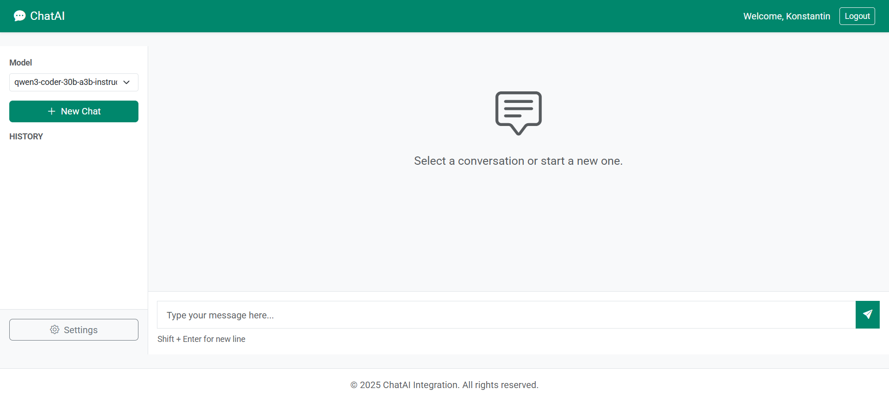
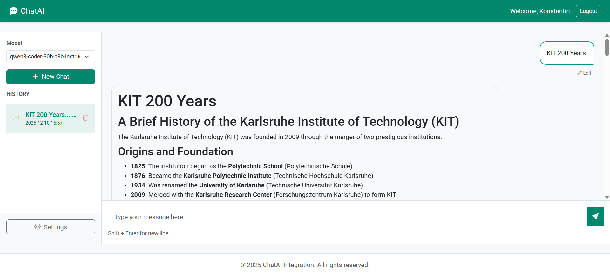
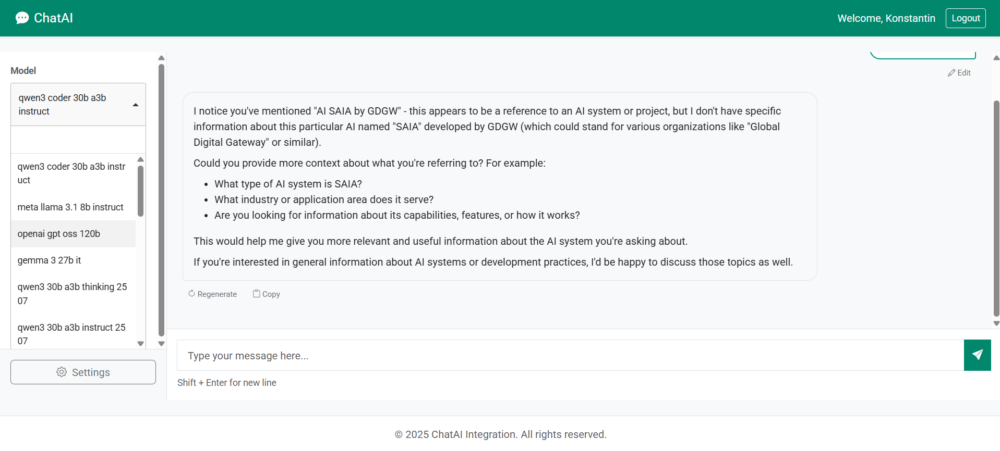

# ChatAI - AI-Powered Chat Application

A Flask-based web application for AI-powered chat interactions with support for multiple models, conversation management, and advanced features. Containerized with Docker and using PostgreSQL for data persistence.

<div align="center">
  
  <p><em>Clean and modern chat interface</em></p>
</div>

<div align="center">
  
  <p><em>Rich markdown support and code highlighting</em></p>
</div>

<div align="center">
  
  <p><em>Extensive model selection with search capabilities</em></p>
</div>

## 🌟 Features

### Core Functionality
- **Multi-Model Support**: Interact with various AI models including Llama and GPT variants
- **Real-Time Streaming**: Get responses as they're generated for a smooth experience
- **Conversation Management**: Save, load, and delete conversation history
- **User Authentication**: Secure login and registration with session management
- **Image Support**: Upload and analyze images with vision-capable models

### Advanced Features
- **System Instructions**: Define custom AI personas and behaviors
- **Stop Generation**: Interrupt ongoing responses at any time
- **Edit Messages**: Modify your previous messages and regenerate responses
- **Regenerate Responses**: Re-run the last message to get a different answer
- **Context Window Management**: Automatic token limit handling for long conversations
- **Mobile Responsive**: Optimized interface for mobile and desktop devices

### Technical Features
- **Docker Containerization**: Easy deployment and scaling
- **PostgreSQL Database**: Robust data persistence
- **Error Handling**: Comprehensive error management and user feedback
- **Streaming Response**: Token-by-token response generation
- **Session Caching**: Efficient model list caching

---

## 📋 Prerequisites

- Docker and Docker Compose
- API access to AI models (e.g., SAIA, OpenAI)
- Basic knowledge of environment variables

---

## 🚀 Quick Start

### 1. Clone the Repository
```bash
git clone <repository-url>
cd ChatAI
```

### 2. Configure Environment
Create a `.env` file in the root directory:

```env
# API Configuration
API_KEY=your_api_key_here
SAIA_BASE_URL=https://chat-ai.academiccloud.de/v1

# Flask Configuration
SECRET_KEY=your_secret_key_here

# Registration Token (for new user signups)
REGISTRATION_TOKEN=your_registration_token
```

### 3. Build and Run
```bash
# Build and start the containers
docker compose up --build

# Access the application
# Navigate to http://localhost:5000
```

### 4. Stop the Application
```bash
# Stop and remove containers
docker compose down

# Stop and remove containers with volumes (clears database)
docker compose down -v
```

---

## 🏗️ Project Structure

```
ChatAI/
├── app/
│   ├── __init__.py              # Flask application factory
│   ├── extensions.py            # Flask extensions (SQLAlchemy, Login Manager)
│   ├── models.py                # Database models (User, Conversation, Message)
│   ├── auth/                    # Authentication routes and logic
│   │   ├── __init__.py
│   │   └── routes.py
│   ├── main/                    # Main chat functionality
│   │   ├── __init__.py
│   │   └── routes.py            # Chat routes and API endpoints
│   ├── services/                # Business logic layer
│   │   ├── __init__.py
│   │   ├── chat_service.py      # AI model interaction service
│   │   └── conversation_service.py  # Database operations service
│   ├── utils/                   # Utility modules
│   │   ├── __init__.py
│   │   └── capabilities.py      # Model capability checker
│   ├── static/                  # Static assets
│   │   ├── css/
│   │   │   └── styles.css
│   │   ├── js/
│   │   │   └── main.js          # Chat interface logic
│   │   └── assets/
│   │       └── models.json
│   ├── templates/               # Jinja2 HTML templates
│       ├── base.html
│       ├── index.html           # Main chat interface
│       ├── login.html
│       └── register.html
│   └── commands.py              # CLI commands (init-db, etc.)
├── migrations/                  # Database migrations
├── repo_assets/                 # Documentation assets
├── config.py                    # Application configuration
├── run.py                       # Application entry point
├── requirements.txt             # Python dependencies
├── Dockerfile                   # Container image definition
├── docker-compose.yml           # Docker services configuration
├── entrypoint.sh               # Container startup script
└── README.md                    # This file
```

---

## 💻 Development

### Running in Development Mode
The application is configured to run in development mode by default with hot-reload enabled.

```bash
# Start services
docker compose up

# The Flask app will automatically reload on code changes
```

### Accessing Logs
```bash
# View all logs
docker compose logs -f

# View specific service logs
docker compose logs -f web
docker compose logs -f db
```

### Database Management
```bash
# Initialize database
docker compose exec web python init_db.py

# Access PostgreSQL CLI
docker compose exec db psql -U chatai_user -d chatai_db

# Create database backup
docker compose exec db pg_dump -U chatai_user chatai_db > backup.sql

# Restore database backup
docker compose exec -T db psql -U chatai_user chatai_db < backup.sql
```

---

## 🔧 Configuration

### Environment Variables

| Variable | Description | Default |
|----------|-------------|---------|
| `API_KEY` | API key for AI model access | *Required* |
| `SAIA_BASE_URL` | Base URL for AI API | `https://chat-ai.academiccloud.de/v1` |
| `DATABASE_URL` | PostgreSQL connection string | *See .env.example* |
| `SECRET_KEY` | Flask session secret key | *Required* |
| `FLASK_ENV` | Flask environment (development/production) | `development` |
| `REGISTRATION_TOKEN` | Token required for user registration | *Optional* |

### Model Configuration
Available models are fetched dynamically from the API. To add or modify models, update the API endpoint or the `static/assets/models.json` file.

---

## 🎯 Usage Guide

### First Time Setup
1. Navigate to `http://localhost:5000`
2. Click "Register" to create an account
3. If registration token is required, contact your administrator
4. Log in with your credentials

### Starting a Conversation
1. Select a model from the dropdown in the sidebar
2. Type your message in the input box at the bottom
3. Press Enter or click the send button
4. Watch as the AI responds in real-time

### Using Advanced Features

#### System Instructions
1. Open the Settings panel in the sidebar
2. Enter custom instructions (e.g., "You are a Python expert")
3. Click "Save as Default" to persist settings
4. All new conversations will use these instructions

#### Stop Generation
- Click the red stop button that appears during response generation
- The response will be interrupted and saved at its current state

#### Edit Messages
- Hover over any of your messages
- Click the "Edit" button that appears
- Modify the text and save
- The conversation will regenerate from that point

#### Regenerate Response
- Hover over the last AI response
- Click the "Regenerate" button
- A new response will be generated for the same prompt

---

## 🏛️ Architecture

### Backend Architecture
```
┌─────────────┐
│   Client    │
│  (Browser)  │
└──────┬──────┘
       │ HTTP/SSE
┌──────▼──────┐
│   Flask     │
│   Routes    │
└──────┬──────┘
       │
       ├─────────────┐
       │             │
┌──────▼──────┐ ┌───▼────────┐
│   Chat      │ │ Conversation│
│  Service    │ │   Service   │
└──────┬──────┘ └───┬────────┘
       │            │
       │     ┌──────▼──────┐
       │     │  PostgreSQL │
       │     │  Database   │
       │     └─────────────┘
       │
┌──────▼──────┐
│  AI Model   │
│     API     │
└─────────────┘
```

### Service Layer
- **ChatService**: Handles AI model interactions, token management, and API communication
- **ConversationService**: Manages database operations for conversations and messages

### Key Design Patterns
- **Service Layer Pattern**: Business logic separated from routes
- **Repository Pattern**: Database operations abstracted in services
- **Streaming Pattern**: Server-Sent Events for real-time responses
- **Factory Pattern**: Flask application factory for flexibility

---

## 🔒 Security Considerations

- **Authentication Required**: All routes protected with `@login_required`
- **Password Hashing**: Werkzeug security for password storage
- **Session Management**: Flask-Login for secure sessions
- **CSRF Protection**: Built-in Flask-WTF CSRF protection
- **Environment Variables**: Sensitive data stored in `.env` file
- **Input Validation**: Parameter validation on all endpoints

---

## 🐛 Troubleshooting

### Application Won't Start
```bash
# Check if ports are already in use
docker compose down
docker ps

# Rebuild containers
docker compose up --build
```

### Database Connection Issues
```bash
# Check database logs
docker compose logs db

# Reset database
docker compose down -v
docker compose up
```

### API Connection Errors
- Verify `API_KEY` in `.env` file
- Check `SAIA_BASE_URL` is correct
- Ensure network connectivity to API server
- Review logs for detailed error messages

### Frontend Not Loading
```bash
# Clear browser cache
# Check browser console for errors
# Verify static files are being served
docker compose logs web | grep "GET /static"
```

---

## 📊 Performance Optimization

### Token Limit Management
The application automatically manages context windows:
- Estimates token usage for messages
- Implements sliding window for long conversations
- Reserves space for model responses
- Logs token usage for monitoring

### Caching
- Model list cached in session
- Static assets cached by browser
- Database query optimization with SQLAlchemy

---

## 🧪 Testing

```bash
# Install test dependencies
pip install pytest pytest-flask

# Run tests (when implemented)
pytest tests/

# Run with coverage
pytest --cov=app tests/
```

---

## 📝 API Endpoints

### Authentication
- `GET /login` - Login page
- `POST /login` - Login submission
- `GET /register` - Registration page
- `POST /register` - Registration submission
- `GET /logout` - Logout user

### Chat Interface
- `GET /` - Main chat interface
- `POST /chat_stream` - Send message and receive streaming response
- `GET /get_conversations` - Retrieve user's conversations
- `GET /conversation/<id>` - Load specific conversation
- `POST /new_conversation` - Create new conversation
- `DELETE /delete_conversation/<id>` - Delete conversation
- `POST /reset` - Reset conversation (clear messages)

### Settings
- `GET /get_models` - Fetch available AI models
- `GET /get_settings` - Get user settings
- `POST /update_settings` - Update user settings

---

## 🤝 Contributing

This is an internal project. For contributions or suggestions:
1. Contact the project administrator
2. Follow the existing code structure and patterns
3. Add comprehensive error handling
4. Document new features in code and README
5. Test thoroughly before deployment

---

## 📜 License

© 2025 ChatAI. All rights reserved.  
This project is for internal use only and is not distributed externally.

---

## 📞 Support

For access, technical issues, or questions:
- **Administrator**: Contact your system administrator
- **Documentation**: Refer to this README and inline code comments
- **Issues**: Check application logs for detailed error messages

---

## 🔄 Version History

### v2.0.0 (Current)
- ✨ Added stop generation functionality
- ✨ Added message editing capability
- ✨ Added response regeneration
- ✨ Implemented system instructions
- ✨ Added context window management
- 🐛 Fixed double sidebar issue
- 🔧 Improved mobile responsiveness
- 🔧 Refactored service layer
- 🔧 Enhanced error handling
- 📝 Comprehensive code documentation

### v1.0.0
- Initial release
- Basic chat functionality
- User authentication
- Conversation management
- Docker containerization

---

## 🙏 Acknowledgments

- Bootstrap 5 for UI framework
- Flask and its extensions for backend
- OpenAI API format for model integration
- Docker for containerization
- PostgreSQL for database

---

**Built with ❤️ for efficient AI-powered conversations**

## ✍️ Author

**Konstantin Soballa**
